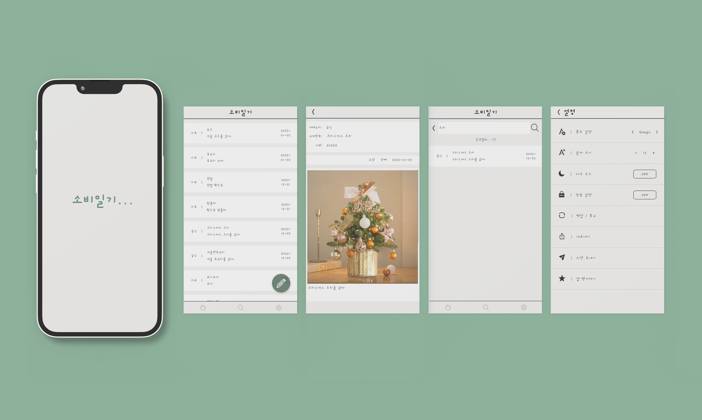
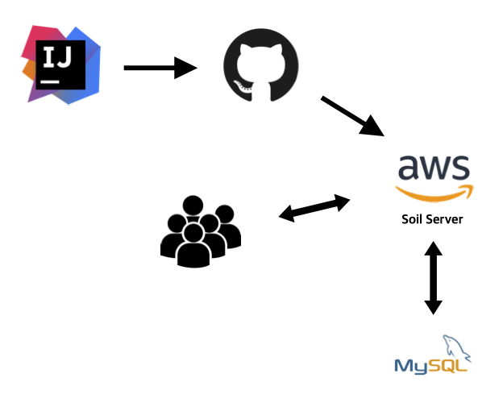
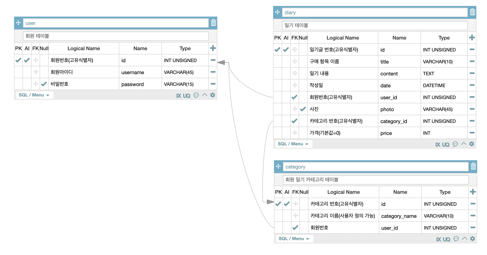

# 소비일기(SOIL)

* 나의 소비기록을 기록하고 공유하는 서비스 소비일기 개발 프로젝트 백엔드(서버) 소스코드 저장소
* 기간 : 2022.08 ~ 2023.05
* 환경 : WEB, RESTful API
* 개발 툴 : IntelliJ IDEA, MySQL Workbench 8.0.20
* 사용 언어 : Java 11, MySQL 8
* 사용 기술 : Spring Boot, JPA, Gradle, Open API(네이버 로그인 API), AWS(EC2, RDS, S3), Swagger

# Application UI

# Architecture

# ERD 다이어그램

# 주요 기능
* [각 기능별 비즈니스 로직](devlog/soil-business-logic.md)
* [각 기능별 Use Case](devlob/soil-use-case.md)   

## 사용자
1. 회원가입 / 탈퇴
2. 소셜로그인
3. 일기 작성 / 수정 / 삭제 / 조회
4. 키워드로 게시글 검색
5. 카테고리 생성 / 수정 / 삭제 / 조회
